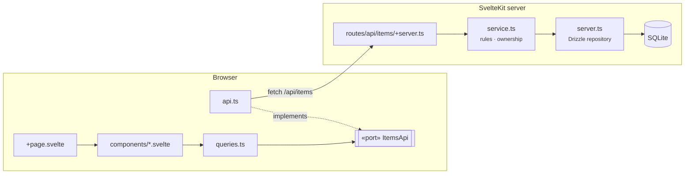

# SOLID in Practice

<p class="lead">Reading our SSR template through five principles</p>

<p class="muted">SvelteKitten · create-sveltekitten v0.3.8 · Team session</p>

<!--
สวัสดีครับทุกคน วันนี้เราจะคุยเรื่อง SOLID (Single responsibility, Open/closed, Liskov substitution, Interface segregation, Dependency inversion) กัน แต่ผมอยากบอกไว้ก่อนเลยว่าวันนี้ไม่ได้มาท่องนิยามห้าข้อให้จำนะครับ เป้าหมายจริง ๆ คืออยากให้ทีมมี "ภาษาเดียวกัน" เวลาคุยเรื่อง design

ตัวอย่างทุกอันในวันนี้เอามาจากโค้ดจริงใน SSR (Server-Side Rendering) template ของเรา ซึ่งเป็นโค้ดที่ทุกคนใช้เริ่มโปรเจกต์ใหม่อยู่แล้ว เราจะดูกันทั้งจุดที่ template ทำได้ดี และจุดที่ยังทำไม่ถึง

ใช้เวลาประมาณสี่สิบห้านาที แล้วเปิดให้คุยกันต่อท้าย ถ้าระหว่างทางมีคำถามก็ยกมือถามได้เลยครับ ไม่ต้องรอ
-->

---

# Why this matters for us

<div class="grid grid-cols-3 gap-6 mt-10">
<div class="card" v-click>

## Shared vocabulary

"This breaks SRP" should mean the same thing to everyone in the review.

</div>
<div class="card" v-click>

## Consistent reviews

Fewer "I'd do it differently" threads. More "this violates *X*, here's the fix."

</div>
<div class="card" v-click>

## Templates multiply decisions

Every project starts from `templates/ssr/`. Agents copy `agent-role.md`. A good or bad pattern here shows up **N times**.

</div>
</div>

<!--
ทำไมเรื่องนี้ถึงสำคัญกับทีมเรา มีสามเหตุผลครับ

ข้อแรกคือภาษากลาง เวลามีคนเขียนใน review ว่า "อันนี้ผิด SRP (Single Responsibility Principle)" ทุกคนควรเข้าใจตรงกันว่าหมายถึงอะไร ตอนนี้ผมเชื่อว่าแต่ละคนตีความไม่เหมือนกัน

ข้อสองคือ review จะวนน้อยลง ถ้าเราตกลงหลักการกันได้ comment จะเปลี่ยนจาก "ผมจะเขียนอีกแบบ" เป็น "ตรงนี้ผิดหลักข้อนี้ แก้แบบนี้"

ข้อสามสำคัญที่สุดครับ template คือจุดตั้งต้นของทุกโปรเจกต์ agent ของเราก็อ่าน agent-role.md แล้วเลียนแบบ pattern ใน template ต่อ ถ้า template มี pattern ดี เราได้ของดีคูณ N ถ้ามี pattern แย่ ก็ได้ของแย่คูณ N เหมือนกัน
-->

---

# Agenda

<div class="mt-8 grid grid-cols-[1fr_auto] gap-x-10 gap-y-2 max-w-xl">

<div><strong>0 · The map</strong> <span class="muted">— one request through <code>items</code></span></div><div class="muted">3 min</div>
<div><strong>S</strong> · Single Responsibility</div><div class="muted">7 min</div>
<div><strong>O</strong> · Open / Closed</div><div class="muted">7 min</div>
<div><strong>L</strong> · Liskov Substitution</div><div class="muted">7 min</div>
<div><strong>I</strong> · Interface Segregation</div><div class="muted">5 min</div>
<div><strong>D</strong> · Dependency Inversion</div><div class="muted">8 min</div>
<div><strong>Template audit</strong> <span class="muted">— scorecard, security, smells</span></div><div class="muted">6 min</div>
<div><strong>Applying it</strong> <span class="muted">— checklist, limits, next steps</span></div><div class="muted">5 min</div>

</div>

<p class="mt-8 muted">Each principle: <span class="pill">concept</span> → <span class="pill">in our template</span> → <span class="pill">where it's missing</span> → <span class="pill">takeaway</span></p>

<!--
นี่คือลำดับของวันนี้ครับ เริ่มจากแผนที่ของ feature items ก่อน เพื่อให้ทุกคนเห็นภาพเดียวกัน จากนั้นไล่ห้าหลักการ S O L I D (Single Responsibility, Open/Closed, Liskov Substitution, Interface Segregation, Dependency Inversion) ตามด้วยการ audit template แบบภาพรวม แล้วปิดท้ายด้วยวิธีเอาไปใช้จริง

แต่ละหลักการจะเดินรูปแบบเดียวกันหมด คือเริ่มจาก concept สั้น ๆ แล้วดูว่าใน template ของเราทำไว้ตรงไหน ต่อด้วยจุดที่ยังขาด และจบด้วย takeaway ที่เอาไปใช้ตอน review ได้ทันที

D (Dependency Inversion) จะใช้เวลานานที่สุด เพราะเป็นข้อที่ template เราลงทุนไปเยอะที่สุด และยังเหลืองานค้างอยู่มากที่สุดด้วย
-->

---

# The map: one request through `items`



<p class="muted text-sm mt-4">Keep this picture in mind — every principle today points at one of these boxes.</p>

<SourceRef path="templates/ssr/src/lib/features/items/ · templates/ssr/src/routes/api/items/+server.ts" />

<!--
ภาพนี้คือแผนที่ที่เราจะใช้ตลอดวันนี้ครับ ลองเดินตาม request หนึ่งครั้งด้วยกัน

สมมติผู้ใช้กด checkbox ใน item-card ตัว component จะเรียก hook useToggleItem ใน queries.ts ตัว hook ไม่ได้รู้จัก fetch โดยตรง มันรู้จักแค่ interface ItemsApi ใน port.ts ส่วนตัวที่ implement จริงคือ api.ts ซึ่งยิง fetch ไปที่ /api/items

พอข้ามมาฝั่ง server ตัว route handler จะรับ request แล้วส่งต่อให้ service.ts ซึ่งเป็นที่ตรวจว่าผู้ใช้เป็นเจ้าของ item จริงไหม จากนั้น service ค่อยเรียก server.ts ซึ่งเป็น repository ที่คุยกับ Drizzle และ SQLite

ขอให้จำกล่องพวกนี้ไว้นะครับ เพราะทุกหลักการที่เราจะคุยจะชี้กลับมาที่กล่องในภาพนี้
-->

---
class: section
---

<div class="watermark">S</div>

# Single Responsibility

<p class="lead mt-6">"A module should be responsible to one, and only one, <strong>actor</strong>."</p>

<p class="mt-2"><span class="strike">"A function should do one thing."</span></p>

<div class="grid grid-cols-3 gap-4 mt-10 max-w-3xl">
<div class="card" v-click><h3>Actor</h3><p><strong>DBA / schema</strong></p><p>"Rename the column."</p></div>
<div class="card" v-click><h3>Actor</h3><p><strong>Product / rules</strong></p><p>"Only owners may delete."</p></div>
<div class="card" v-click><h3>Actor</h3><p><strong>API consumer</strong></p><p>"Return 422, not 400."</p></div>
</div>

<!--
เริ่มที่ S ครับ Single Responsibility

ประโยคที่คนชอบพูดกันคือ "ฟังก์ชันหนึ่งควรทำแค่อย่างเดียว" ผมขีดฆ่าไว้เพราะนั่นไม่ใช่ SRP (Single Responsibility Principle) ครับ นั่นเป็นแค่หลักเขียนฟังก์ชันให้เล็ก ซึ่งก็ดี แต่คนละเรื่องกัน

นิยามของ Uncle Bob คือ module หนึ่งควรรับผิดชอบต่อ actor เดียว actor ก็คือคนหรือกลุ่มที่จะเดินมาขอให้เราแก้โค้ด

ลองดูสามตัวอย่างนี้ครับ คนดูแล schema อาจขอเปลี่ยนชื่อ column ฝั่ง product อาจขอว่าให้เฉพาะเจ้าของลบได้ ฝั่งคนเรียก API (Application Programming Interface) อาจขอเปลี่ยน status code สามคำขอนี้มาจากสามคน ถ้าไปรวมอยู่ไฟล์เดียว การแก้ของคนหนึ่งก็เสี่ยงไปพังของอีกคน

คำถามที่ควรถามตัวเองคือ "ใครจะมาขอให้แก้ไฟล์นี้" ไม่ใช่ "ฟังก์ชันนี้สั้นพอหรือยัง"
-->

---

# In our template: repository vs. service <Verdict kind="follows" />

<div class="grid grid-cols-2 gap-5 mt-4">
<div>

### server.ts — talks to the database

```ts
export async function getItemById(
  id: string
): Promise<DbItem | undefined> {
  return db.select().from(items).where(eq(items.id, id)).get();
}

export async function updateItemCompletion(
  id: string,
  completed: boolean
): Promise<DbItem | undefined> {
  return db.update(items).set({ completed })
    .where(eq(items.id, id)).returning().get();
}
```

<p class="muted text-xs">Changes when: the schema or the ORM changes.</p>

</div>
<div>

### service.ts — owns the rules

```ts {all|4-10|all}
export class ItemNotFoundError extends Error {}
export class ItemForbiddenError extends Error {}

async function assertOwnedByUser(id: string, userId: string | undefined) {
  const existing = await getItemById(id);
  if (!existing) throw new ItemNotFoundError();
  if (existing.userId && existing.userId !== userId)
    throw new ItemForbiddenError();
  return existing;
}

export async function toggleItemCompletion(
  id: string, completed: boolean, userId?: string
) {
  await assertOwnedByUser(id, userId);
  const updated = await updateItemCompletion(id, completed);
  if (!updated) throw new ItemNotFoundError();
  return updated;
}
```

<p class="muted text-xs">Changes when: a business / authorization rule changes.</p>

</div>
</div>

<SourceRef path="features/items/server.ts:20-44 · features/items/service.ts:11-38" />

<!--
นี่คือ SRP (Single Responsibility Principle) ที่ template เราทำไว้ดีแล้วครับ

ซ้ายคือ server.ts ซึ่งเป็น repository มันทำอย่างเดียวคือคุยกับฐานข้อมูลผ่าน Drizzle ไม่มีกฎทางธุรกิจอยู่ในนี้เลย

ขวาคือ service.ts (คลิก) ตรงที่ highlight คือ assertOwnedByUser ซึ่งเป็นกฎว่า item ต้องเป็นของผู้ใช้คนนี้ก่อนถึงจะแก้หรือลบได้ กฎนี้อยู่ที่ service เท่านั้น

ถ้าวันหนึ่งเราย้ายจาก SQLite ไป Postgres เราแก้แค่ฝั่งซ้าย ถ้า product บอกว่าให้ admin ลบของคนอื่นได้ เราแก้แค่ฝั่งขวา สองเหตุผลนี้ไม่มาปนกัน นี่คือหัวใจของ SRP ครับ

ขอให้สังเกตบรรทัดที่เจ็ดฝั่งขวาไว้ด้วยนะครับ เงื่อนไข existing.userId && ... ตรงนี้มีปัญหาอยู่ เดี๋ยวเราจะกลับมาดูตอนพาร์ต security
-->

---

# How we got here — v0.3.2

````md magic-move {lines: false}
```ts
// routes/api/items/+server.ts — before (v0.3.1)
import { getItems, insertItem, updateItemCompletion, removeItem } from '$lib/features/items/server';

export const PATCH: RequestHandler = async ({ request }) => {
  const { id, completed } = await request.json();
  // ...validate payload...
  const updated = await updateItemCompletion(id, completed);
  return json(updated);
};

export const DELETE: RequestHandler = async ({ request, url }) => {
  // ...read id...
  await removeItem(id);        // anyone can delete anyone's item
  return json({ success: true });
};
```
```ts
// routes/api/items/+server.ts — now
import { deleteItemForUser, toggleItemCompletion, /* … */ } from '$lib/features/items/service';

export const PATCH: RequestHandler = async ({ request, locals }) => {
  const { id, completed } = await request.json();
  // ...validate payload...
  const updated = await toggleItemCompletion(id, completed, locals.user?.id);
  return json(updated);
};

export const DELETE: RequestHandler = async ({ request, url, locals }) => {
  // ...read id...
  await deleteItemForUser(id, locals.user?.id);
  return json({ success: true });
};
```
````

<blockquote class="mt-4 text-sm" v-click>
"New use-case layer between the route and the repository: this is where per-item ownership checks live, since the repository never verified that a toggled/deleted item's userId matched the requesting user."
<div class="muted text-xs mt-1">— src/codemods/v0.3.2.ts:149-151</div>
</blockquote>

<!--
สไลด์นี้เล่าว่าเรามาถึงตรงนี้ได้ยังไงครับ

ก่อน v0.3.2 ตัว route handler import ฟังก์ชันจาก server.ts ตรง ๆ แล้วเรียก updateItemCompletion หรือ removeItem ได้เลย ไม่มีใครตรวจว่าเป็นเจ้าของ item หรือเปล่า แปลว่าใครก็ลบของใครก็ได้ ถ้ารู้ id

(คลิก) ตอนนี้ route เรียก service แทน แล้วส่ง locals.user?.id เข้าไปด้วย ตัว service เป็นคนตัดสินใจเรื่องสิทธิ์

(คลิก) นี่คือ comment ที่เราเขียนไว้ใน codemod ตอนนั้นเลยครับ ประเด็นคือถ้าไม่มี layer นี้ กฎเรื่องสิทธิ์ก็ไม่มีที่อยู่ ต้องไปกระจายอยู่ในทุก route handler

ข้อสังเกตคือการแยก layer ไม่ได้ทำให้โค้ดดูเท่ขึ้น แต่ทำให้กฎ authorization มีที่อยู่ชัดเจนเพียงที่เดียว
-->

---

# SRP takeaway: who asks, which file changes

<p class="muted">Guess the file before revealing it.</p>

| Change request | Actor | File you touch |
|---|---|---|
| "Add a `dueDate` column" | Schema | <span v-click>`server/db/schema.ts` + `features/items/server.ts`</span> |
| "Only owners may delete" | Product | <span v-click>`features/items/service.ts`</span> |
| "Return 422 for invalid payloads" | API consumer | <span v-click>`routes/api/items/+server.ts`</span> |
| "Show a spinner while toggling" | UI | <span v-click>`components/item-card.svelte`</span> |

<p class="mt-8" v-click><strong>Rule of thumb in review:</strong> if one PR touches two rows' files for one request, ask why.</p>

<!--
ลองเล่นกันหน่อยครับ ผมจะอ่านคำขอ แล้วให้ทุกคนตอบก่อนว่าต้องแก้ไฟล์ไหน แล้วผมค่อยเปิดเฉลย

ข้อแรก เพิ่ม column dueDate (รอคำตอบ แล้วคลิก) แก้ schema กับ repository

ข้อสอง ให้เฉพาะเจ้าของลบได้ (คลิก) แก้ service อย่างเดียว

ข้อสาม เปลี่ยน status code เป็น 422 (คลิก) แก้ route handler

ข้อสี่ ใส่ spinner (คลิก) แก้ component

(คลิก) ข้อสรุปที่ใช้ตอน review ได้คือ ถ้า PR (Pull Request) เดียวที่ทำคำขอเดียวต้องไปแก้หลายแถวในตารางนี้ ให้ถามว่าทำไม บางทีมันก็มีเหตุผล แต่บ่อยครั้งมันเป็นสัญญาณว่ามีความรับผิดชอบรั่วไปอยู่ผิดที่
-->

---
class: section
---

<div class="watermark">O</div>

# Open / Closed

<p class="lead mt-6">Open for <strong>extension</strong>, closed for <strong>modification</strong>.</p>

<p class="mt-4 max-w-2xl">In practice: design <strong>extension points</strong> where you expect change, so new behaviour is <em>added</em> — not threaded through code that already works.</p>

<div class="grid grid-cols-2 gap-4 mt-8 max-w-3xl">
<div class="card" v-click><h3>Smell</h3><p>Adding a case means editing <code>if / else</code> or <code>switch</code> in several files.</p></div>
<div class="card" v-click><h3>Shape</h3><p>A list, record, pipeline or strategy you <em>append</em> to.</p></div>
</div>

<!--
ต่อที่ O ครับ Open/Closed

ความหมายคือโค้ดควรเปิดให้ต่อเติม แต่ปิดไม่ให้ต้องแก้ ฟังแล้วอาจงงว่าจะไม่แก้ไฟล์เลยได้ยังไง ผมขอย้ำว่า OCP (Open/Closed Principle) ไม่ได้แปลว่าห้ามแก้ไฟล์ครับ

ในทางปฏิบัติ มันแปลว่าตรงไหนที่เราคาดว่าจะมีของใหม่เพิ่มเข้ามาเรื่อย ๆ เราควรออกแบบ "จุดต่อ" ไว้ เพื่อให้การเพิ่มของใหม่เป็นการเติมเข้าไป ไม่ใช่การไปแทรกแก้โค้ดเดิมที่ทำงานดีอยู่แล้ว

(คลิก) กลิ่นที่บอกว่าผิด OCP คือ เพิ่มเคสใหม่ทีไรต้องไปแก้ if/else หรือ switch หลายไฟล์

(คลิก) รูปแบบที่ถูกคือมีรายการ record pipeline หรือ strategy ที่เราแค่เพิ่ม entry เข้าไป
-->

---

# Where we already have it <Verdict kind="follows" />

<div class="grid grid-cols-2 gap-6 mt-4">
<div>

### A pipeline of request handlers

```ts
// hooks.server.ts
import { sequence } from '@sveltejs/kit/hooks';
import { handleFastApiClient } from '$lib/hooks/fastapi.hook';
import { handleAuthGuard } from '$lib/hooks/auth-guard';

export const handle: Handle = sequence(handleAuthGuard, handleFastApiClient);
```

<p class="text-sm">New cross-cutting concern (rate limit, request id, CSP)? Write a new <code>Handle</code>, append it. Existing hooks stay untouched.</p>

</div>
<div>

### A query-key factory

```ts
// features/items/queries.ts
export const itemKeys = {
  all: ['items'] as const,
  lists: () => [...itemKeys.all, 'list'] as const,
  detail: (id: string) => [...itemKeys.all, 'detail', id] as const
};
```

<p class="text-sm">New query shape? Add a key. Everything invalidating <code>itemKeys.all</code> keeps working.</p>

</div>
</div>

<SourceRef path="templates/ssr/src/hooks.server.ts:1-6 · features/items/queries.ts:7-11" />

<!--
template ของเรามี OCP (Open/Closed Principle) อยู่แล้วสองจุดครับ

ซ้ายคือ hooks.server.ts ที่ใช้ sequence ของ SvelteKit ตัวนี้คือ plugin pipeline ขนาดเล็ก ถ้าพรุ่งนี้เราอยากเพิ่ม rate limit หรือใส่ request id ให้ทุก request เราเขียน Handle ใหม่แล้วต่อท้ายเข้าไป ไม่ต้องไปแก้ auth guard หรือ fastapi hook เลย

ขวาคือ itemKeys ซึ่งเป็น factory ของ query key ถ้าเราจะเพิ่ม query แบบใหม่ เช่น list ที่มี filter เราก็แค่เพิ่ม key เข้าไป ส่วนโค้ดที่ invalidate itemKeys.all อยู่แล้วก็ยังทำงานถูกเหมือนเดิม เพราะ key ใหม่ขึ้นต้นด้วย prefix เดียวกัน

ทั้งสองจุดนี้เป็นตัวอย่างของ "จุดต่อ" ที่ผมพูดถึงเมื่อกี้ครับ
-->

---

# Where we don't: branching that grows <Verdict kind="gap" />

<div class="grid grid-cols-2 gap-5 mt-2">
<div>

### Error → HTTP, repeated per handler

```ts
// +server.ts — PATCH (40-44), copied again in DELETE (55-59)
} catch (err) {
  if (err instanceof ItemNotFoundError)
    return json({ error: 'Item not found' }, { status: 404 });
  if (err instanceof ItemForbiddenError)
    return json({ error: 'Forbidden' }, { status: 403 });
  return json({ error: 'Failed to update item' }, { status: 500 });
}
```

<p class="text-sm" v-click>Add <code>ItemConflictError</code> → edit <strong>every</strong> handler.</p>

</div>
<div>

### One filter, two files, two styles

```ts
// item-list.svelte:18, 25-31
let filter = $state<'all' | 'active' | 'completed'>('all');
const filteredItems = $derived(
  items.filter((item) => {
    if (filter === 'active') return !item.completed;
    if (filter === 'completed') return item.completed;
    return true;
  })
);
```

```ts
// item-empty-state.svelte:5, 10-16
filter: 'all' | 'active' | 'completed';
const message = $derived(
  filter === 'completed' ? 'No completed items yet.'
  : filter === 'active' ? 'No active items. All tasks done!'
  : 'No items created yet. Add one to get started!'
);
```

<p class="text-sm" v-click>Add "overdue" → edit the type twice, the <code>if</code>, the ternary, and hand-copy a 4th button.</p>

</div>
</div>

<SourceRef path="routes/api/items/+server.ts:40-58 · components/item-list.svelte:18-64 · components/item-empty-state.svelte:5-16" />

<!--
ทีนี้มาดูจุดที่ยังไม่ใช่ OCP (Open/Closed Principle) ครับ

ซ้ายคือการแปลง error เป็น HTTP (HyperText Transfer Protocol) response ใน +server.ts ซึ่งเขียนเป็น instanceof chain และก็อปซ้ำทั้งใน PATCH และ DELETE (คลิก) ถ้าวันหนึ่งเราเพิ่ม ItemConflictError เราต้องไปแก้ทุก handler และถ้าลืมไปสักที่ error นั้นจะกลายเป็น 500 ทันที

ขวาคือ filter ของ item list ตัว union type 'all' | 'active' | 'completed' ประกาศซ้ำสองที่ ตัว filter ใช้ if chain ส่วน empty state ใช้ ternary ซ้อน ปุ่มสามปุ่มใน item-list ก็ก็อปวางด้วยมือ

(คลิก) ลองถามทีมครับว่า ถ้าอยากเพิ่ม filter "overdue" ต้องแก้กี่ที่ (รอคำตอบ) คำตอบคืออย่างน้อยห้าที่ในสองไฟล์ นี่คือสัญญาณชัดเจนว่าขาดจุดต่อ
-->

---

# Refactor sketch <Verdict kind="proposal" />

<div class="grid grid-cols-2 gap-5 mt-2">
<div>

### Errors carry their own status

```ts
// reuse the existing (unused) ApiError in utils/api-core.ts
export class ItemNotFoundError extends ApiError {
  constructor() { super('Item not found', 404, null); }
}
export class ItemForbiddenError extends ApiError {
  constructor() { super('Forbidden', 403, null); }
}

export function toErrorResponse(
  err: unknown, fallback: string
) {
  if (err instanceof ApiError) {
    return json({ error: err.message }, { status: err.status });
  }
  return json({ error: fallback }, { status: 500 });
}

// every handler:
} catch (err) {
  return toErrorResponse(err, 'Failed to update item');
}
```

</div>
<div>

### Filters as data

````md magic-move {lines: false}
```ts
let filter = $state<'all' | 'active' | 'completed'>('all');
const filteredItems = $derived(
  items.filter((item) => {
    if (filter === 'active') return !item.completed;
    if (filter === 'completed') return item.completed;
    return true;
  })
);
```
```ts
// features/items/filters.ts
export const itemFilters = {
  all: {
    label: 'All',
    predicate: () => true,
    empty: 'No items created yet. Add one to get started!'
  },
  active: {
    label: 'Active',
    predicate: (i: Item) => !i.completed,
    empty: 'No active items. All tasks done!'
  },
  completed: {
    label: 'Completed',
    predicate: (i: Item) => i.completed,
    empty: 'No completed items yet.'
  }
} satisfies Record<string, ItemFilter>;
export type ItemFilterKey = keyof typeof itemFilters;

// item-list.svelte
let filter = $state<ItemFilterKey>('all');
const filteredItems = $derived(
  items.filter(itemFilters[filter].predicate)
);
// buttons: {#each Object.entries(itemFilters) as [key, f] (key)}
```
````

</div>
</div>

<p class="text-sm mt-2 muted">New error → one class. New filter → one entry. No existing handler or component changes.</p>

<!--
นี่คือข้อเสนอครับ ยังไม่ได้แก้ใน template นะครับ ติดป้าย proposal ไว้

ซ้ายคือให้ error รู้ status ของตัวเอง ใน utils/api-core.ts เรามี ApiError ที่มี status อยู่แล้ว แต่ไม่มีใครใช้เลย เราก็ให้ domain error สืบทอดจากตัวนี้ แล้วมี toErrorResponse ฟังก์ชันเดียว ทุก handler เรียกบรรทัดเดียวจบ พอเพิ่ม error ใหม่ก็แค่เพิ่ม class ไม่ต้องไปแตะ handler

ขวา (คลิก) คือเปลี่ยน filter จากการแตกแขนงให้เป็นข้อมูล record เดียวเก็บทั้ง label, predicate และข้อความตอนว่าง ทั้ง list ปุ่ม และ empty state อ่านจากที่เดียวกัน type ก็ derive มาจาก record เลย ไม่ต้องประกาศซ้ำ

เพิ่ม filter overdue ก็คือเพิ่มหนึ่ง entry จบครับ
-->

---
class: section
---

<div class="watermark">L</div>

# Liskov Substitution

<p class="lead mt-6">Anything that stands in for an interface must keep <strong>its promises</strong> — not just its signature.</p>

<div class="grid grid-cols-3 gap-4 mt-10 max-w-3xl">
<div class="card" v-click><h3>Preconditions</h3><p>Don't demand <em>more</em> from callers.</p></div>
<div class="card" v-click><h3>Postconditions</h3><p>Don't return <em>less</em> than promised.</p></div>
<div class="card" v-click><h3>Failure</h3><p>Fail the way callers were told to expect.</p></div>
</div>

<p class="mt-8" v-click><strong>TypeScript checks the shape. LSP is about behaviour.</strong></p>

<!--
มาถึง L ครับ Liskov Substitution

นิยามแบบใช้งานได้จริงคือ อะไรก็ตามที่มาแทน interface ได้ ต้องรักษาคำสัญญาของ interface นั้นให้ครบ ไม่ใช่แค่ signature ตรงกัน

(คลิก) ข้อแรก precondition อย่าเรียกร้องจากคนเรียกมากกว่าที่ interface บอก
(คลิก) ข้อสอง postcondition อย่าคืนของน้อยกว่าที่สัญญาไว้
(คลิก) ข้อสาม เวลาพังต้องพังในแบบที่คนเรียกถูกบอกไว้ว่าให้รอรับ

(คลิก) ประโยคสำคัญที่สุดของหัวข้อนี้คือ TypeScript ตรวจได้แค่รูปร่าง แต่ LSP (Liskov Substitution Principle) พูดเรื่องพฤติกรรม type ผ่านไม่ได้แปลว่าไม่ผิด LSP เดี๋ยวเราจะดู bug จริงที่เคยเกิดขึ้นใน template ของเราครับ
-->

---

# Our contract: `ItemsApi`

<div class="grid grid-cols-[1fr_1fr] gap-6 mt-4">
<div>

<<< @/../../templates/ssr/src/lib/features/items/port.ts

<p class="muted text-xs mt-2">Imported live from the template.</p>

</div>
<div>

### What the type doesn't say

<v-clicks>

- `createItem` / `toggleItem` resolve with the **persisted** row — real `id`, real `title`, real `completed`.
- On failure they **reject with an `Error`** whose `message` is safe to show in a toast.
- `deleteItem` resolves **only after** the row is gone.
- `fetchItems` returns **this user's** items, newest first.

</v-clicks>

<p class="text-sm mt-4" v-click>Every implementation — <code>api.ts</code>, a test fake, a future FastAPI adapter — owes callers all four.</p>

</div>
</div>

<SourceRef path="templates/ssr/src/lib/features/items/port.ts" />

<!--
นี่คือ interface ItemsApi ของเราครับ ดึงมาจากไฟล์จริงใน template เลย ถ้า template เปลี่ยน สไลด์นี้ก็เปลี่ยนตาม

ดูแค่ type แล้วมันบอกไม่หมดครับ ทางขวาคือคำสัญญาที่ไม่ได้เขียนอยู่ใน type

(คลิกไล่ทีละข้อ) createItem กับ toggleItem ต้องคืน row ที่บันทึกแล้วจริง ๆ ไม่ใช่ของที่ปั้นขึ้นมา เวลาพังต้อง reject ด้วย Error ที่ message เอาไปโชว์ใน toast ได้ deleteItem ต้อง resolve หลังจากลบเสร็จแล้วเท่านั้น และ fetchItems ต้องคืนของผู้ใช้คนนี้ เรียงจากใหม่ไปเก่า

(คลิก) ใครก็ตามที่ implement interface นี้ ไม่ว่าจะเป็น api.ts ตัวจริง fake ที่ใช้ใน test หรือ adapter ที่ไปคุยกับ FastAPI ในอนาคต ต้องรักษาคำสัญญาครบทั้งสี่ข้อ ถ้า fake ใน test ไม่รักษาคำสัญญา test ก็จะผ่านทั้งที่ของจริงพัง
-->

---

# A real violation we shipped — fixed in v0.3.1 <Verdict kind="gap" />

````md magic-move {lines: false}
```ts
// features/items/api.ts — toggleItem, before v0.3.1
// (PATCH /api/items only returned { success: true })
  if (!res.ok) {
    const err = await res.json().catch(() => ({}));
    throw new Error(err.error || 'Failed to update item');
  }
  return {
    id,
    title: '',                              // ← fabricated
    completed,
    createdAt: new Date().toISOString()     // ← fabricated
  };
}
```
```ts
// features/items/api.ts — toggleItem, now
// (PATCH /api/items returns the updated row)
  if (!res.ok) {
    const err = await res.json().catch(() => ({}));
    throw new Error(err.error || 'Failed to update item');
  }
  const data = await res.json();
  return {
    ...data,
    description: data.description ?? undefined,
    createdAt: typeof data.createdAt === 'string' ? data.createdAt : new Date(data.createdAt).toISOString()
  };
}
```
````

<div class="grid grid-cols-2 gap-5 mt-3">
<div v-click>

```ts
// queries.ts:44-50 — the caller trusted the contract
onSuccess: (updatedItem) => {
  toast.success(updatedItem.completed
    ? `Completed "${updatedItem.title}"`
    : `Marked "${updatedItem.title}" as active`);
}
```

</div>
<div v-click class="card">

<p><strong>User saw:</strong> <code>Completed ""</code></p>
<p>Type-checked. Compiled. Wrong.</p>

</div>
</div>

<SourceRef path="src/codemods/v0.3.1.ts:23-45, 52-53 · features/items/queries.ts:44-50" />

<!--
นี่คือ bug จริงที่เราเคย ship ไปครับ

ก่อน v0.3.1 ตัว PATCH ฝั่ง server คืนแค่ success: true ไม่ได้คืน item กลับมา แต่ interface บอกว่า toggleItem ต้องคืน Item ฝั่ง api.ts ก็เลยปั้น Item ปลอมขึ้นมา title เป็นสตริงว่าง createdAt เป็นเวลาปัจจุบัน

(คลิก) นี่คือโค้ดใน queries.ts ที่เชื่อคำสัญญาของ interface มันเอา updatedItem.title ไปใส่ใน toast

(คลิก) ผลคือผู้ใช้เห็น toast ว่า Completed "" type ผ่าน compile ผ่าน แต่พฤติกรรมผิด นี่แหละครับคือตัวอย่างของการผิด LSP (Liskov Substitution Principle)

(คลิก magic-move) ตอนนี้เราแก้แล้ว server คืน row จริง api.ts ก็คืนข้อมูลจริง

บทเรียนคือ ถ้าเราไม่สามารถรักษาคำสัญญาได้ ให้แก้คำสัญญาหรือแก้แหล่งข้อมูล อย่าปั้นข้อมูลปลอมให้ type ผ่าน
-->

---

# Guarding LSP: contract tests <Verdict kind="proposal" />

```ts
// features/items/port.contract.ts
export function describeItemsApiContract(name: string, makeApi: () => ItemsApi) {
  describe(`${name} honours ItemsApi`, () => {
    it('toggleItem resolves with the persisted item, not a stub', async () => {
      const api = makeApi();
      const created = await api.createItem({ title: 'Write the SOLID deck' });
      const toggled = await api.toggleItem(created.id, true);
      expect(toggled).toMatchObject({ id: created.id, title: 'Write the SOLID deck', completed: true });
    });

    it('rejects with a readable Error when the item does not exist', async () => {
      await expect(makeApi().toggleItem('missing', true)).rejects.toThrow(/not found/i);
    });
  });
}

describeItemsApiContract('fakeItemsApi', () => createFakeItemsApi());
describeItemsApiContract('itemsApi (against a test server)', () => itemsApi);
```

<p class="text-sm mt-3">One suite, every implementation. The fake used to test <code>queries.ts</code> can no longer lie.</p>
<p class="text-sm muted">Today the SSR template has <strong>no unit tests</strong> — only <code>e2e/login.test.ts</code>.</p>

<!--
แล้วเราจะกันไม่ให้ผิด LSP (Liskov Substitution Principle) อีกได้ยังไงครับ ข้อเสนอคือ contract test

เขียน test suite ชุดเดียวที่บรรยายคำสัญญาของ ItemsApi แล้วรันกับทุก implementation ทั้ง fake ที่ใช้ใน test และตัวจริงที่คุยกับ test server

ข้อดีคือ fake ของเราจะโกหกไม่ได้ เพราะมันต้องผ่าน test เดียวกับของจริง ถ้าวันหนึ่งมีคนเขียน implementation ใหม่ที่ปั้นข้อมูลปลอมแบบเมื่อกี้ test แรกก็จะจับได้ทันที

อีกเรื่องที่ต้องพูดตรง ๆ คือตอนนี้ SSR (Server-Side Rendering) template ยังไม่มี unit test เลยครับ มีแค่ e2e (end-to-end test) ของ login ตัวเดียว ข้อนี้เลยเป็นทั้งเรื่อง LSP และเรื่อง testing strategy ของ template ด้วย เดี๋ยวตอนท้ายจะเอาไปรวมใน action item
-->

---
class: section
---

<div class="watermark">I</div>

# Interface Segregation

<p class="lead mt-6">No client should be forced to depend on methods it doesn't use.</p>

<div class="grid grid-cols-2 gap-8 mt-8 max-w-3xl">
<div class="card">
<h3>One fat interface</h3>
<div class="isp-row"><span class="isp-box">Form</span><span class="isp-box">Card</span><span class="isp-box">List</span></div>
<div class="isp-row isp-arrows"><span>↓</span><span>↓</span><span>↓</span></div>
<div class="isp-row"><span class="isp-box isp-box--wide">ItemsEverything · 12 methods</span></div>
</div>
<div class="card" v-click>
<h3>Role-shaped</h3>
<div class="isp-row"><span class="isp-box">Form</span><span class="isp-box">Card</span><span class="isp-box">List</span></div>
<div class="isp-row isp-arrows"><span>↓</span><span>↓</span><span>↓</span></div>
<div class="isp-row"><span class="isp-box">create</span><span class="isp-box">toggle · delete</span><span class="isp-box">read</span></div>
</div>
</div>

<p class="text-sm mt-6">The cost of a fat interface: every change ripples to every client, and every test fake has to stub all 12 methods.</p>

<!--
ต่อที่ I ครับ Interface Segregation

หลักคือไม่ควรบังคับให้ใครต้องพึ่ง method ที่ตัวเองไม่ได้ใช้

ภาพซ้ายคือ interface อ้วนตัวเดียว ทุก component พึ่งมันหมด ภาพขวาคือ interface ที่แยกตามบทบาท form พึ่งแค่ create card พึ่งแค่ toggle กับ delete list พึ่งแค่ read

ต้นทุนของ interface อ้วนมีสองอย่างครับ อย่างแรกคือ coupling ถ้า method ไหนเปลี่ยน ทุก client ก็โดนผลกระทบไปด้วย อย่างที่สองซึ่งเจอบ่อยกว่าคือ fake ใน test ต้อง stub ทุก method ทั้งที่ test นั้นใช้อยู่แค่ method เดียว
-->

---

# In our template: hooks per use case <Verdict kind="follows" />

<div class="grid grid-cols-3 gap-4 mt-4">
<div class="card">
<h3>item-form.svelte</h3>

```ts
import { useCreateItem } from '../queries';
```

</div>
<div class="card">
<h3>item-card.svelte</h3>

```ts
import { useToggleItem, useDeleteItem }
  from '../queries';
```

</div>
<div class="card">
<h3>item-list.svelte</h3>

```ts
import { useItems } from '../queries';
```

</div>
</div>

<p class="mt-4">Each component depends on exactly the hooks it calls — the segregation happens at the hook layer.</p>

<div class="card mt-6" v-click>

### Should `ItemsApi` split into `ItemsReader` / `ItemsWriter`?

<p><strong>Not yet.</strong> 4 methods, one consumer (<code>queries.ts</code>), one implementation. Split when a second consumer only needs half — e.g. a read-only dashboard or a public widget.</p>

</div>

<SourceRef path="components/item-form.svelte:8 · components/item-card.svelte:7 · components/item-list.svelte:5" />

<!--
ใน template ของเรา ISP (Interface Segregation Principle) เกิดขึ้นที่ชั้น hook ครับ

item-form ใช้แค่ useCreateItem ส่วน item-card ใช้ toggle กับ delete และ item-list ใช้แค่ useItems แต่ละ component รู้จักแค่สิ่งที่ตัวเองใช้ ข้อนี้เราทำได้ดีแล้ว

(คลิก) คำถามที่น่าคุยคือ ควรแยก ItemsApi เป็น Reader กับ Writer ไหม คำตอบของผมคือยังไม่ต้องครับ ตอนนี้มีแค่สี่ method มีคนใช้แค่ queries.ts คนเดียว และมี implementation เดียว

ผมอยากใช้สไลด์นี้ย้ำว่า ISP ไม่ได้บังคับให้เราแตก interface ทุกครั้ง เราจะแยกก็ต่อเมื่อมี client ตัวที่สองที่ใช้แค่ครึ่งเดียว เช่นหน้า dashboard ที่อ่านได้อย่างเดียว ถึงตอนนั้นค่อยแยก
-->

---

# Where it leaks: one `Locals` for two backends <Verdict kind="gap" />

<div class="grid grid-cols-2 gap-5 mt-2">
<div>

```ts
// app.d.ts:11-15
interface Locals {
  user: User | null;              // SQLite session mode
  session: Session | null;        // SQLite session mode
  fastapiClient: Client<paths>;   // FastAPI BFF mode
}
```

```ts
// hooks.server.ts:6 — both run on every request
export const handle: Handle = sequence(handleAuthGuard, handleFastApiClient);
```

</div>
<div>

```ts
// src/index.ts:180-181 — the CLI copies everything
const templateDir = join(TEMPLATES_DIR, template as string);
await cp(templateDir, targetDir, { recursive: true, force: true });
```

<p class="text-sm">The CLI asks <em>fullstack vs FastAPI</em>, stores <code>ssrMode</code> in <code>.sveltekitten.json</code> — then ships <strong>both</strong> stacks either way.</p>

<p class="text-sm">A fullstack project still carries <code>fastapiClient</code>, the proxy route and JWT cookie logic. A FastAPI project still carries SQLite, Drizzle and sessions.</p>

</div>
</div>

<p class="mt-4" v-click><strong>Discussion:</strong> overlay files per <code>ssrMode</code>? Or split <code>Locals</code> by capability so each route depends only on what it uses?</p>

<SourceRef path="templates/ssr/src/app.d.ts:11-15 · templates/ssr/src/hooks.server.ts:6 · src/index.ts:180-181" />

<!--
แต่มีจุดที่ ISP (Interface Segregation Principle) รั่วอยู่ครับ อยู่ที่ App.Locals

ทุก request มีทั้ง user กับ session ของโหมด SQLite และ fastapiClient ของโหมด FastAPI ไม่ว่าเราจะเลือกโหมดไหนตอน scaffold ตัว handleFastApiClient ก็รันทุก request แม้ในโปรเจกต์ fullstack ที่ไม่ได้ใช้ FastAPI เลย

ต้นเหตุอยู่ใน CLI (Command-Line Interface) ครับ ทางขวาคือ src/index.ts ตัว CLI ถามว่าจะเอา fullstack หรือ FastAPI แล้วเก็บ ssrMode ไว้ใน .sveltekitten.json แต่ตอน copy มันก็อปทั้งโฟลเดอร์เหมือนกันทั้งสองโหมด ไม่มี overlay

ผลคือทุกโปรเจกต์ได้ของทั้งสอง stack มาหมด

(คลิก) อันนี้ผมยังไม่มีคำตอบนะครับ อยากชวนคุย ว่าเราควรแยกไฟล์ตาม ssrMode หรือควรแยก Locals ตาม capability
-->

---
class: section
---

<div class="watermark">D</div>

# Dependency Inversion

<p class="lead mt-4">High-level policy must not depend on low-level detail. <strong>Both depend on an abstraction</strong> — and the abstraction belongs to the <strong>consumer</strong>.</p>

<div class="grid grid-cols-2 gap-8 mt-8 max-w-4xl">
<div class="card">
<h3>Before (≤ v0.3.2)</h3>
<div class="flow"><span class="isp-box">queries.ts</span><span class="flow-arrow">→</span><span class="isp-box">api.ts</span><span class="flow-arrow">→</span><span class="isp-box">fetch</span></div>
<p class="muted text-xs mt-3">Policy points at the detail.</p>
</div>
<div class="card" v-click>
<h3>Now</h3>
<div class="flow"><span class="isp-box">queries.ts</span><span class="flow-arrow">→</span><span class="isp-box flow-port">«port» ItemsApi</span><span class="flow-arrow">←</span><span class="isp-box">api.ts</span></div>
<p class="muted text-xs mt-3"><code>api.ts</code> implements the port (and calls <code>fetch</code>).</p>
</div>
</div>

<p class="text-sm mt-6" v-click>"Inversion": the arrow between <code>queries.ts</code> and <code>api.ts</code> used to point at the detail. Now the detail points at the policy's interface.</p>

<!--
มาถึง D ข้อสุดท้ายครับ Dependency Inversion

มีสองประโยค ประโยคแรกคือโค้ดระดับนโยบายไม่ควรพึ่งรายละเอียดระดับล่าง ทั้งคู่ควรพึ่ง abstraction ประโยคที่สองซึ่งคนมักลืมคือ abstraction นั้นเป็นของฝั่งคนใช้ ไม่ใช่ของฝั่ง implementation

ภาพซ้ายคือก่อน v0.3.3 queries.ts import api.ts ตรง ๆ ลูกศรชี้จากนโยบายไปหารายละเอียด

ภาพขวาคือตอนนี้ queries.ts พึ่ง ItemsApi ใน port.ts ส่วน api.ts ต้องมา implement interface นั้น

(คลิก) คำว่า inversion ก็คือลูกศรระหว่าง queries กับ api มันกลับทิศครับ จากเดิมที่นโยบายชี้ไปหารายละเอียด ตอนนี้รายละเอียดชี้กลับมาหา interface ของนโยบาย
-->

---

# In our template: the `ItemsApi` port <Verdict kind="follows" />

```ts {2-3|13-16|19|all}
// features/items/queries.ts
import { itemsApi as defaultItemsApi } from './api';
import type { ItemsApi } from './port';
import type { CreateItemInput, Item } from './schema';

export const itemKeys = {
  all: ['items'] as const,
  lists: () => [...itemKeys.all, 'list'] as const,
  detail: (id: string) => [...itemKeys.all, 'detail', id] as const
};

export function useItems(
  initialDataGetter?: () => Item[] | undefined,
  itemsApi: ItemsApi = defaultItemsApi
) {
  return createQuery(() => ({
    queryKey: itemKeys.lists(),
    queryFn: itemsApi.fetchItems,
    initialData: initialDataGetter ? initialDataGetter() : undefined,
    staleTime: 1000 * 60
  }));
}
```

<blockquote class="text-sm mt-2">"…swap it for a fake in tests without touching <code>queries.ts</code>." <span class="muted text-xs">— agent-role.md:44</span></blockquote>

<SourceRef path="templates/ssr/src/lib/features/items/queries.ts:1-23" />

<!--
นี่คือ DIP (Dependency Inversion Principle) ใน template ของเราครับ ไล่ดูทีละจุด

(คลิก) บรรทัดสองสาม queries.ts import type ItemsApi จาก port และยัง import ตัวจริงมาเป็นค่า default

(คลิก) บรรทัด 13 ถึง 16 ตัว hook รับ itemsApi เป็น parameter ถ้าไม่ส่งมาก็ใช้ตัวจริง

(คลิก) บรรทัด 19 queryFn เรียกผ่าน parameter ไม่ได้เรียก api.ts ตรง ๆ

ผลคือเวลาเขียน test เราส่ง fake เข้าไปใน useItems ได้เลย ไม่ต้องไปแก้ queries.ts และไม่ต้อง mock module ด้วย ตรงกับที่ agent-role.md เขียนไว้

เก็บคำว่า "ค่า default" ไว้ในใจนะครับ เดี๋ยวอีกสองสไลด์เราจะกลับมาดูว่ามันมีข้อจำกัดยังไง
-->

---

# How we got here — v0.3.3

````md magic-move {lines: false}
```ts
// features/items/queries.ts — at a1d783a (v0.3.0)
import * as api from './api';
import type { CreateItemInput, Item } from './schema';

export function useItems(initialDataGetter?: () => Item[] | undefined) {
  return createQuery(() => ({
    queryKey: itemKeys.lists(),
    queryFn: api.fetchItems,
    initialData: initialDataGetter ? initialDataGetter() : undefined,
    staleTime: 1000 * 60
  }));
}
```
```ts
// features/items/queries.ts — now
import { itemsApi as defaultItemsApi } from './api';
import type { ItemsApi } from './port';
import type { CreateItemInput, Item } from './schema';

export function useItems(
  initialDataGetter?: () => Item[] | undefined,
  itemsApi: ItemsApi = defaultItemsApi
) {
  return createQuery(() => ({
    queryKey: itemKeys.lists(),
    queryFn: itemsApi.fetchItems,
    initialData: initialDataGetter ? initialDataGetter() : undefined,
    staleTime: 1000 * 60
  }));
}
```
````

<blockquote class="mt-4 text-sm" v-click>
"Explicit ItemsApi port: queries.ts previously imported api.ts as a concrete module (<code>import * as api from './api'</code>) with no interface, so nothing could be swapped or mocked without editing queries.ts."
<div class="muted text-xs mt-1">— src/codemods/v0.3.3.ts:98-100</div>
</blockquote>

<!--
เหมือนกับตอน SRP (Single Responsibility Principle) ครับ นี่คือประวัติจริงของเรา

ก่อน v0.3.3 queries.ts import * as api from './api' แล้วเรียก api.fetchItems ตรง ๆ ไม่มี interface อะไรคั่นอยู่เลย

(คลิก magic-move) ตอนนี้มี port แล้ว และ hook ก็รับ implementation เป็น parameter

(คลิก) นี่คือ comment ใน codemod ที่อธิบายเหตุผล คือเมื่อก่อนเราสลับหรือ mock อะไรไม่ได้เลยถ้าไม่ไปแก้ queries.ts

อยากให้ทีมสังเกตว่า refactor ทั้ง SRP ใน v0.3.2 และ DIP (Dependency Inversion Principle) ใน v0.3.3 เราทำกันมาแล้วจริง ๆ ไม่ใช่ทฤษฎี และทุกโปรเจกต์เก่าก็ได้รับการแก้ผ่าน codemod ด้วย
-->

---

# Where the inversion stops <Verdict kind="gap" />

<div class="grid grid-cols-3 gap-4 mt-2">
<div class="card">

### 1 · Components never inject

```ts
// item-card.svelte:15-16
const toggleMutation = useToggleItem();
const deleteMutation = useDeleteItem();
```

<p>The default parameter is <strong>"bastard injection"</strong>: swappable when you call the hook, <em>not</em> when you render <code>&lt;ItemList&gt;</code>.</p>

</div>
<div class="card">

### 2 · `health` has no port

```ts
// health/queries.ts:2
import * as api from './api';

// health/api.ts:1
import fastapiClient
  from '$lib/api/fastapi-client';

// home/+page.svelte:5
import * as api
  from '$lib/features/health/api';
```

<p>The exact "before" picture <code>items</code> left behind in v0.3.3.</p>

</div>
<div class="card">

### 3 · No server-side port

```ts
// service.ts:1-8
import { getItemById, /* … */ }
  from './server';

// server.ts:1
import { db } from '$lib/server/db';
```

<p>The ownership rule — the most important logic in the feature — <strong>can't be tested without a real SQLite file</strong>.</p>

</div>
</div>

<SourceRef path="components/item-card.svelte:15-16 · features/health/queries.ts:2 · features/items/service.ts:1-8 · features/items/server.ts:1" />

<!--
DIP (Dependency Inversion Principle) ของเรายังไปไม่สุดครับ มีสามจุด

จุดแรก ไม่มี component ไหนส่ง port เข้าไปเลย item-card เรียก useToggleItem() แบบเปล่า ๆ ค่า default แบบนี้มีชื่อเรียกว่า bastard injection คือสลับ implementation ได้ตอนเรียก hook ตรง ๆ แต่ถ้าเรา render ItemList ทั้งก้อนใน test หรือใน storybook เราสลับไม่ได้เลย

จุดที่สอง feature health ไม่มี port เลย ใช้ import * as api เหมือน items ก่อน v0.3.3 เป๊ะ แถม api.ts ของ health ยังพึ่ง fastapiClient ที่เป็น singleton อีก

จุดที่สามสำคัญที่สุดครับ ฝั่ง server ไม่มี port เลย service.ts import ฟังก์ชันจาก server.ts ตรง ๆ และ server.ts ก็ import db ที่เป็น singleton ผลคือกฎ ownership ซึ่งเป็น logic ที่สำคัญที่สุดของ feature นี้ ทดสอบไม่ได้ถ้าไม่มี SQLite จริง

ปัญหานี้เป็นปัญหาเดียวกับที่ port ฝั่ง client แก้ไปแล้ว แค่เรายังไม่ได้ทำฝั่ง server
-->

---

# Next step sketch <Verdict kind="proposal" />

<div class="grid grid-cols-2 gap-5 mt-2">
<div>

### Client: provide the port via context

```ts
// features/items/context.ts
import { createContext } from 'svelte';
import type { ItemsApi } from './port';
export const [getItemsApi, setItemsApi] = createContext<ItemsApi>();

// queries.ts
export function useItems(initialDataGetter?: () => Item[] | undefined) {
  const itemsApi = getItemsApi();
  // …
}

// routes/+layout.svelte   → setItemsApi(itemsApi)
// test / storybook harness → setItemsApi(createFakeItemsApi())
```

<p class="text-xs muted"><code>agent-role.md:84</code> already recommends <code>createContext</code> — no feature uses it yet.</p>

</div>
<div>

### Server: inject the repository

```ts
// features/items/service.ts
export interface ItemsRepository {
  getById(id: string): Promise<DbItem | undefined>;
  listByUser(userId: string): Promise<DbItem[]>;
  insert(input: CreateItemInput, userId: string): Promise<DbItem>;
  setCompleted(id: string, done: boolean): Promise<DbItem | undefined>;
  remove(id: string): Promise<void>;
}

export function createItemsService(repo: ItemsRepository) {
  async function assertOwnedByUser(id: string, userId: string) { /* … */ }
  return { listItems, addItem, toggleItemCompletion, deleteItemForUser };
}
```

```ts
// service.test.ts — no SQLite
const repo = inMemoryRepo([{ id: 'a', userId: 'alice' }]);
const service = createItemsService(repo);
await expect(service.deleteItemForUser('a', 'bob'))
  .rejects.toBeInstanceOf(ItemForbiddenError);
```

</div>
</div>

<!--
ข้อเสนอสำหรับขั้นต่อไปครับ ย้ำอีกทีว่าเป็นข้อเสนอให้ทีมพิจารณา ยังไม่ได้ตัดสินใจ

ซ้ายคือฝั่ง client ให้ส่ง ItemsApi ผ่าน context ด้วย createContext ของ Svelte ซึ่ง agent-role.md ก็แนะนำไว้อยู่แล้ว แต่ยังไม่มี feature ไหนใช้ root layout set ตัวจริง ส่วน test หรือ storybook set ตัว fake พอทำแบบนี้ component ทั้งก้อนก็สลับ implementation ได้ ไม่ใช่แค่ hook

ขวาคือฝั่ง server ให้ service รับ repository interface เข้ามาผ่าน factory createItemsService พอทำแบบนี้เราก็ทดสอบกฎ ownership ได้ด้วย in-memory repo ดูตัวอย่าง test ข้างล่างครับ แค่ไม่กี่บรรทัด ไม่ต้องมี SQLite เลย

ถ้าเราทำสองอย่างนี้ D (Dependency Inversion) ของเราก็จะครบทั้งสองฝั่ง
-->

---
layout: default
---

# Template audit: scorecard

| | Already follows | Gap |
|---|---|---|
| **S** | Repository `server.ts` vs. rules in `service.ts` | `+page.server.ts` bypasses the service · toasts inside `queries.ts` · login action does 5 jobs |
| **O** | `sequence(...)` hook pipeline · `itemKeys` factory | `instanceof` chains per handler · filter branching in 2 files · hard-coded auth strategy |
| **L** | Fake `Item` removed in v0.3.1 | No contract tests — no unit tests at all |
| **I** | One hook per use case · small `ItemsApi` | One `Locals` shape for both backend modes |
| **D** | `ItemsApi` port + injectable hooks (v0.3.3) | Components never inject · `health` has no port · no server-side repository port |

<p class="mt-6"><strong>Verdict:</strong> the direction is right; the job is half done — mostly on the server side.</p>

<!--
สรุปภาพรวมเป็นตารางครับ ซ้ายคือสิ่งที่ทำได้ดีแล้ว ขวาคือจุดที่ยังขาด

ถ้าดูทั้งตาราง ผมคิดว่า template ของเรามาถูกทางแล้ว ทุกหลักการมีตัวอย่างที่ทำได้ดีอย่างน้อยหนึ่งจุด แต่งานยังทำไปแค่ครึ่งทาง และส่วนที่ยังขาดส่วนใหญ่อยู่ฝั่ง server

อีกข้อที่อยากให้เห็นคือ gap หลายข้อเชื่อมกัน เช่น ถ้าเราทำ repository port ของ D (Dependency Inversion) ได้ เราก็เขียน contract test ของ L (Liskov Substitution) ได้ง่ายขึ้นด้วย

สไลด์ถัดไปเป็นเรื่องที่ผมคิดว่าสำคัญที่สุดของวันนี้ครับ
-->

---

# Security spotlight: why the service layer matters <Verdict kind="gap" />

<div class="grid grid-cols-2 gap-5 mt-2">
<div>

### 1 · Anonymous GET returns everyone's items

```ts
// routes/api/items/+server.ts:12-15 — not under (protected)
export const GET: RequestHandler = async ({ locals }) => {
  const items = await listItems(locals.user?.id);   // undefined
  return json(items);
};
// server.ts:8-17
export async function getItems(userId?: string) {
  if (userId) { /* …where(eq(items.userId, userId)) */ }
  return db.select().from(items).orderBy(desc(items.createdAt)).all();
}
```

### 2 · `null` owner passes the check

```ts
// service.ts:17
if (existing.userId && existing.userId !== userId)
  throw new ItemForbiddenError();
```

<p class="text-xs">Items created without a session get <code>userId: null</code> (<code>server.ts:28</code>) → anyone can toggle / delete them, including FastAPI-JWT users (no <code>locals.user</code>).</p>

</div>
<div>

### Fix lives in one layer <Verdict kind="proposal" />

```ts
// service.ts
export async function listItems(userId: string) {
  return getItems(userId);            // no "everything" fallback
}

async function assertOwnedByUser(id: string, userId: string) {
  const existing = await getItemById(id);
  if (!existing) throw new ItemNotFoundError();
  if (existing.userId !== userId) throw new ItemForbiddenError();
  return existing;
}

// routes/api/items/+server.ts — every method
if (!locals.user) return json({ error: 'Unauthorized' }, { status: 401 });
```

<div class="card mt-3">
<p><strong>Shipping it:</strong> edit template → codemod entry in <code>src/codemods/</code> → version bump → publish <span class="muted">(AGENTS.md)</span></p>
</div>

</div>
</div>

<!--
เรื่องนี้เป็นเรื่อง security ครับ และเป็นเหตุผลที่ดีที่สุดว่าทำไม service layer ถึงสำคัญ

ปัญหาแรก route /api/items ไม่ได้อยู่ใต้ (protected) auth guard จึงไม่ redirect ถ้าไม่มี session locals.user?.id จะเป็น undefined ตัว getItems ใน server.ts เห็นว่าไม่มี userId ก็ตกไปบรรทัดสุดท้ายซึ่งคืน item ของทุกคน แปลว่าใครก็ตามที่ยิง GET /api/items โดยไม่ login จะได้ข้อมูลของผู้ใช้ทุกคน

ปัญหาที่สอง เงื่อนไขใน service บรรทัด 17 ที่ผมบอกให้จำไว้ตอนต้น ถ้า userId ของ item เป็น null เงื่อนไขนี้ก็ผ่าน item ที่สร้างตอนไม่มี session จะได้ userId เป็น null ใครจะแก้จะลบก็ได้ รวมถึงผู้ใช้โหมด FastAPI ที่ไม่มี locals.user ด้วย

ขวาคือข้อเสนอการแก้ครับ เพราะเราแยก SRP (Single Responsibility Principle) ไว้แล้ว การแก้จึงอยู่ใน service เกือบทั้งหมด บวก guard 401 ใน route

ถ้าจะแก้จริงต้องทำตาม AGENTS.md นะครับ แก้ template เพิ่ม codemod bump version แล้ว publish ไม่อย่างนั้นโปรเจกต์ที่สร้างไปแล้วจะไม่ได้รับการแก้ ผมเสนอให้ข้อนี้เป็น action item อันดับหนึ่ง
-->

---

# Other smells worth fixing

<div class="grid grid-cols-2 gap-4 mt-4">
<div class="card" v-click>

### SRP · layering
`(protected)/items/+page.server.ts:2` imports **`server.ts`** directly — breaking the template's own rule *"Route handlers call `service.ts`, never `server.ts` directly."*

</div>
<div class="card" v-click>

### SRP · one mapping, four copies
The `DbItem → Item` normalisation (`?? undefined`, `toISOString()`) lives in `api.ts` ×3 and `+page.server.ts`. One `toItemDto()` on the server would remove all four.

</div>
<div class="card" v-click>

### SRP / DIP · data layer knows the UI
`queries.ts:5` imports `toast` from `svelte-sonner`; every mutation fires one. Data hooks now depend on a specific notification library.

</div>
<div class="card" v-click>

### SRP / OCP · login does five jobs
`login/+page.server.ts:28-116`: FastAPI login, SQLite fallback, raw DB query, auto-register, session. Strategy chosen by `backendUrl !== 'http://localhost:9000'`. → `AuthStrategy[]`.

</div>
</div>

<SourceRef path="routes/(protected)/items/+page.server.ts · features/items/api.ts · features/items/queries.ts:5 · routes/login/+page.server.ts:39-41" />

<!--
นอกจากเรื่อง security ยังมีกลิ่นอื่นที่ควรแก้อีกสี่ข้อครับ ผมจะเลือกเล่าลึกแค่หนึ่งสองข้อตามเวลา

(คลิก) ข้อแรก หน้า items ใน +page.server.ts import server.ts ตรง ๆ ซึ่งขัดกับกฎที่ template เขียนไว้เองว่าห้ามข้าม service ถ้าเรา fix security ใน service แล้วแต่ลืมข้อนี้ หน้านี้ก็จะยังข้ามกฎไปอยู่ดี

(คลิก) ข้อสอง การแปลง DbItem เป็น Item ถูกก็อปไว้สี่ที่ ควรมี toItemDto ที่เดียวฝั่ง server

(คลิก) ข้อสาม toast อยู่ใน queries.ts ทำให้ data layer ไปผูกกับ UI (User Interface) library ถ้าเราจะเอา hook ไปใช้ในที่ที่ไม่อยากมี toast ก็ทำไม่ได้

(คลิก) ข้อสี่ login action ทำห้าอย่างในฟังก์ชันเดียว และเลือก strategy ด้วยการเทียบ string ของ URL (Uniform Resource Locator) ถ้าจะเพิ่ม provider ที่สามก็ต้องไปแก้ทั้งไฟล์นี้และ auth-guard ทางแก้คือทำเป็น AuthStrategy
-->

---

# Docs drift

<div class="mt-6 space-y-5 max-w-3xl">
<div v-click>

**`agent-role.md:48`** says the items feature demonstrates *"optimistic updates"* — there is no `onMutate` anywhere in `src/`.

</div>
<div v-click>

**`itemKeys.detail`** (`queries.ts:10`) is defined but never used.

</div>
<div v-click>

**`index.ts:3`** — `export * as itemsApi from './api'` exports the *module* as `itemsApi`, so barrel consumers reach the typed port object as `itemsApi.itemsApi`.

</div>
</div>

<p class="mt-10 lead" v-click>Agents read <code>agent-role.md</code> as truth. Docs that describe code which doesn't exist get <strong>copied into every new feature</strong>.</p>

<SourceRef path="templates/ssr/agent-role.md:48 · features/items/queries.ts:10 · features/items/index.ts:3" />

<!--
ข้อนี้สั้น ๆ ครับ เป็นเรื่องเอกสารไม่ตรงกับโค้ด

(คลิก) agent-role.md บอกว่า items มี optimistic updates แต่ในโค้ดไม่มี onMutate เลย
(คลิก) itemKeys.detail ประกาศไว้แต่ไม่มีใครใช้
(คลิก) barrel export ใน index.ts export ทั้ง module ออกไปในชื่อ itemsApi คนใช้ต้องเขียน itemsApi.itemsApi ถึงจะได้ object ที่เป็น port จริง ซึ่งงงมาก

(คลิก) ทำไมเรื่องนี้ถึงสำคัญกับเรา เพราะ agent อ่าน agent-role.md เหมือนเป็นความจริง ถ้าเอกสารบอกว่ามีสิ่งที่ไม่มีอยู่จริง agent ก็จะพยายามเลียนแบบ หรือแย่กว่านั้นคือเขียนตามแบบที่ผิด แล้วมันก็จะไปอยู่ในทุก feature ใหม่
-->

---
class: compact
---

# New feature checklist, annotated

| # | Step (from `agent-role.md:86-97`) | Serves |
|---|---|---|
| 1 | `schema.ts` — Zod schemas + inferred types | <span class="pill">L</span> the contract's shape |
| 2 | `server.ts` — repository, **no rules** | <span class="pill">S</span> |
| 3 | `service.ts` — use cases + authorization | <span class="pill">S</span> <span class="pill">D</span> (inject the repo) |
| 4 | `port.ts` — the client API interface | <span class="pill">D</span> <span class="pill">I</span> |
| 5 | `+server.ts` calls **service**, `api.ts` implements **port** | <span class="pill">S</span> <span class="pill">L</span> |
| 6 | `queries.ts` — key factory + hooks on the port | <span class="pill">O</span> <span class="pill">D</span> <span class="pill">I</span> |
| 7 | `components/` — use only the hooks you need | <span class="pill">I</span> |
| 8 | `(protected)/…/+page.server.ts` — prefetch **via service** | <span class="pill">S</span> |

<p class="mt-3 text-xs"><strong>In review:</strong> for each step, ask the principle's question — <em>who changes this? · can I add without editing? · does the fake keep the promise? · does it use all of this? · which way does the arrow point?</em></p>


<!--
เอาทุกอย่างมารวมกันครับ นี่คือ checklist การเพิ่ม feature ใหม่จาก agent-role.md ที่ผมติดป้ายว่าแต่ละขั้นรับใช้หลักการข้อไหน

จะเห็นว่า checklist ที่เรามีอยู่แล้วคือ SOLID (Single responsibility, Open/closed, Liskov substitution, Interface segregation, Dependency inversion) ในทางปฏิบัติ เพียงแต่ไม่เคยมีใครเขียนบอกว่าทำไม ผมเพิ่มสองจุดที่เป็นตัวหนาไว้ด้วย คือขั้นที่สามให้ inject repository และขั้นที่แปดให้ prefetch ผ่าน service

ข้อเสนอของผมคือ หลังจากวันนี้ ทุกครั้งที่ review feature ใหม่ ให้ไล่ถามห้าคำถามข้างล่างนี้ คือใครจะมาขอแก้ เพิ่มได้โดยไม่แก้ไหม fake รักษาคำสัญญาไหม ใช้ครบทุกอย่างไหม และลูกศรชี้ไปทางไหน
-->

---

# SOLID is a tool, not a religion

<div class="grid grid-cols-2 gap-6 mt-6">
<div>

### Over-abstraction is also a smell

<v-clicks>

- A port with one implementation and **no tests** is ceremony.
- Splitting `ItemsApi` into Reader/Writer today = more files, no gain.
- Every layer is a hop a new teammate has to learn.

</v-clicks>

</div>
<div>

### Add an abstraction when…

<v-clicks>

- a **second implementation** exists or is scheduled,
- you need to **test** the policy without the detail,
- two **different actors** keep editing the same file.

</v-clicks>

</div>
</div>

<p class="mt-10 lead" v-click>Otherwise: YAGNI. Write the simple thing; refactor when the second case arrives.</p>

<!--
ก่อนจบ ผมอยากเตือนไว้หนึ่งเรื่องครับ SOLID (Single responsibility, Open/closed, Liskov substitution, Interface segregation, Dependency inversion) เป็นเครื่องมือ ไม่ใช่ศาสนา

(คลิก) การ abstract เกินจำเป็นก็เป็นกลิ่นอย่างหนึ่ง port ที่มี implementation เดียวและไม่มี test เลยก็เป็นแค่พิธีกรรม
(คลิก) อย่างที่เราคุยกันตอน ISP (Interface Segregation Principle) ถ้าแยก ItemsApi ตอนนี้ก็ได้ไฟล์เพิ่มแต่ไม่ได้อะไร
(คลิก) และทุก layer ที่เพิ่มเข้ามาคือสิ่งที่คนใหม่ในทีมต้องเรียนรู้เพิ่ม

ทางขวาคือเกณฑ์ของผมว่าควรเพิ่ม abstraction เมื่อไหร่ (คลิกไล่) เมื่อมี implementation ที่สองจริง เมื่อต้อง test นโยบายโดยไม่มีรายละเอียด และเมื่อมี actor สองคนที่ต่างกันจริงมาแก้ไฟล์เดียวกันซ้ำ ๆ

(คลิก) ถ้าไม่เข้าเกณฑ์ก็ YAGNI (You Aren't Gonna Need It) ครับ เขียนแบบง่ายก่อน แล้ว refactor เมื่อเคสที่สองมาถึง เหมือนที่เราทำกับ items ใน v0.3.2 และ v0.3.3
-->

---

# Proposed next steps

<div class="mt-4 max-w-4xl">

| Priority | Change | Principle |
|---|---|---|
| **1** | Require a user in `/api/items`; drop the `null`-owner bypass in `service.ts` | Security · S |
| **2** | `(protected)/items/+page.server.ts` goes through `service.ts`; one `toItemDto()` | S |
| **3** | `ItemsRepository` port + `createItemsService(repo)`; contract tests for `ItemsApi` | D · L |
| **4** | Status-carrying errors + `toErrorResponse`; `itemFilters` record | O |
| **5** | Give `health` a port; provide ports via `createContext` | D |
| **6** | Fix `agent-role.md` drift and the `itemsApi.itemsApi` barrel | Docs |

</div>

<div class="flex items-end justify-between mt-4">
<p class="text-sm muted max-w-xl">Every item that touches <code>templates/</code> ships with a codemod entry and a version bump — otherwise existing projects never get it.</p>
<h2 class="!text-2xl">Questions?</h2>
</div>

<!--
นี่คือ action item ที่ผมเสนอ เรียงตามความสำคัญครับ

อันดับหนึ่งคือเรื่อง security ควรทำเร็วที่สุด อันดับสองคือทำให้ทุกทางผ่าน service และรวมการ map DTO (Data Transfer Object) ไว้ที่เดียว อันดับสามคือ repository port กับ contract test ซึ่งจะทำให้เราเริ่มมี unit test ใน template ได้ อันดับสี่ห้าหกเป็นงานปรับปรุงที่ทำตามมาได้

ย้ำอีกครั้งนะครับว่าทุกข้อที่แตะ templates ต้องมี codemod และ bump version ตาม AGENTS.md ไม่อย่างนั้นโปรเจกต์ที่สร้างไปแล้วจะไม่ได้รับการแก้

ตอนนี้อยากชวนทุกคนคุยกันสองเรื่อง เรื่องแรกคือลำดับนี้โอเคไหม มีอะไรควรขึ้นหรือลงไหม เรื่องที่สองคือใครอยากรับข้อไหนไป เดี๋ยวเราจดชื่อเจ้าของงานกันตรงนี้เลย

มีคำถามอะไรไหมครับ
-->
